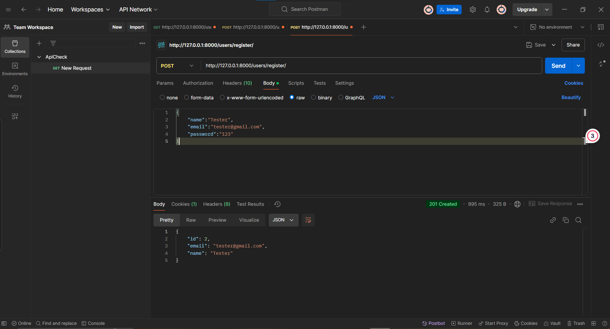
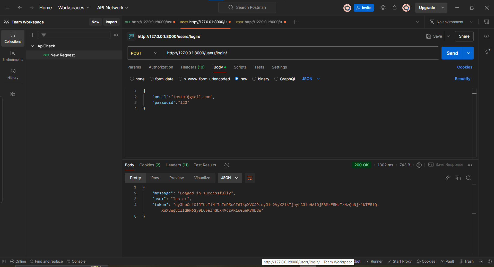
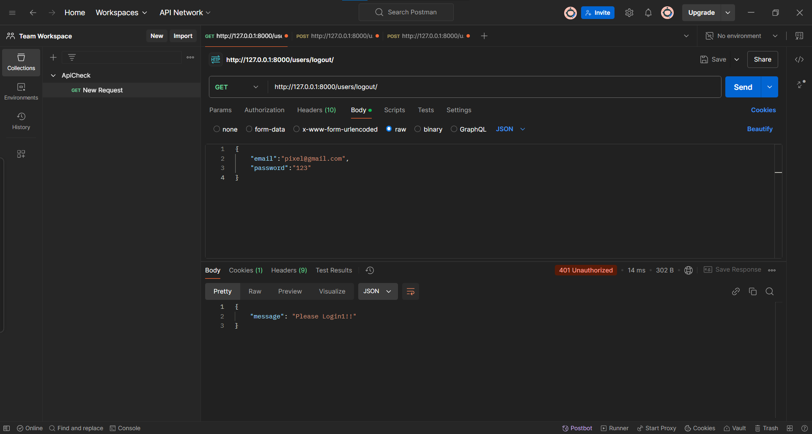
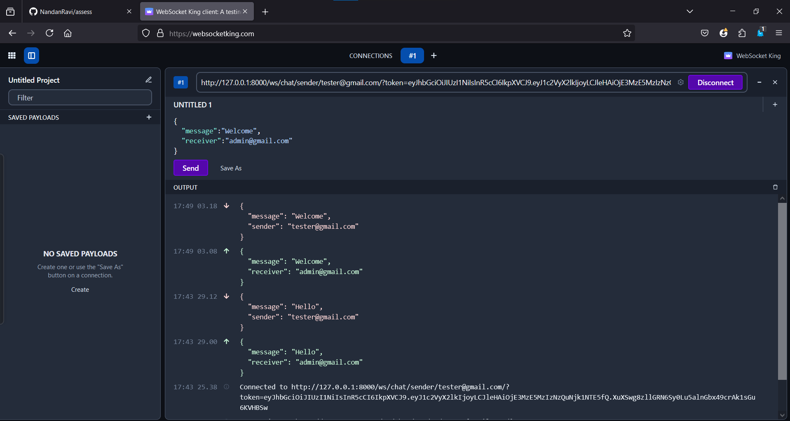
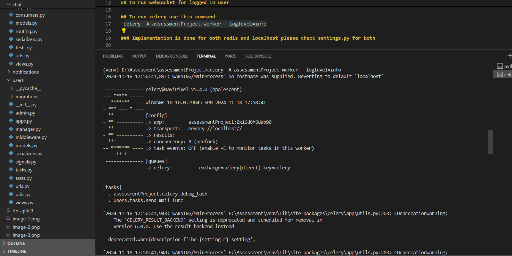

# Django Project

# Table of Contents
## Python Version
'Python 3.11.4'
## List of Module to install
'pip install -r requirements.txt'

## Before running below
'Add EMAIL_HOST_USER, EMAIL_HOST_PASSWORD and JWT_SECRET in settings.py'

## To run websocket for logged in user
'http://127.0.0.1:8000/ws/chat/sender/[Your Email]/?token=[Here will be the token]'
'http://127.0.0.1:8000/ws/chat/receiver/[Your Email]/?token=[Here will be the token]'

## To run celery use this command
'celery -A assessmentProject worker --loglevel=info'

### Implementation is done for both redis and localhost please check settings.py for both 

## Images
"These are the Postman's API"

"WebSocket working"

"Celery Connection"
